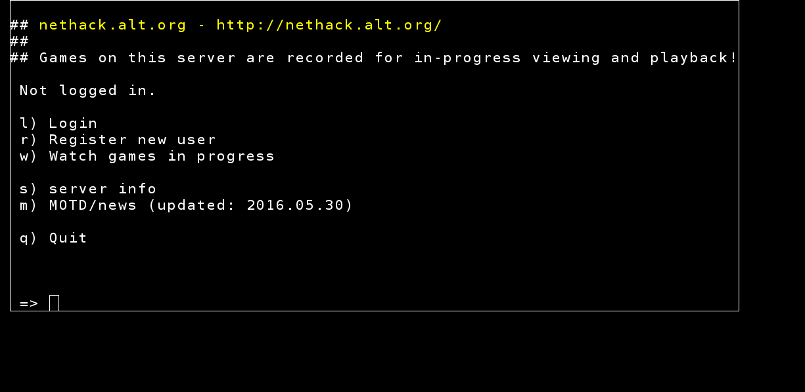
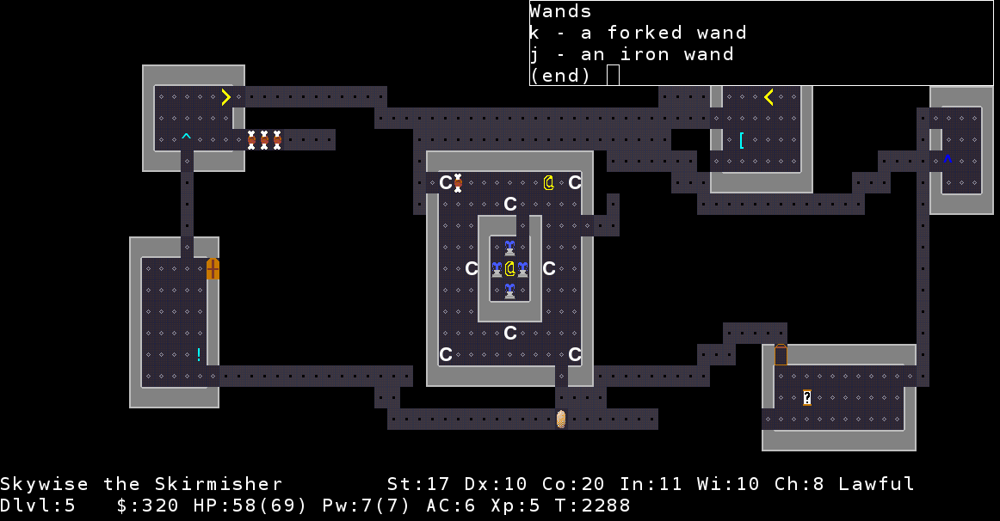
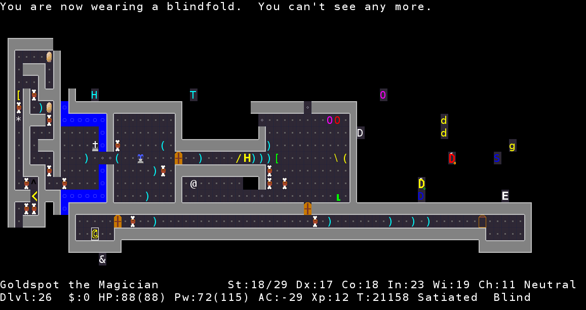

# nethacktiles
Play on nethack.alt.org with graphical tiles

### Installation

    pip install pygame
    git clone https://github.com/alexandrelaplante/nethacktiles.git
    cd nethacktiles/

### Running

    python nethack.py

### Adjusting settings

You'll have to edit a bit of Python. Take a look at `constants.py` to make changes to screen resolution, tilesets and telnet host.

### Why are some tiles missing?

I've been manually adding tiles that I thought were unambiguous. If you want a certain character to appear as a certain tile, add it to `symbols.py`. Also consider contributing your changes here!
